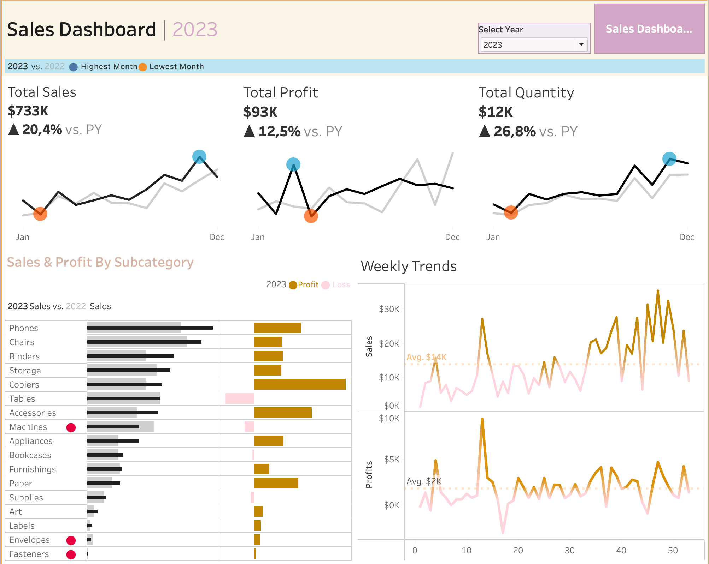

# Sales-Analysis-Tableau-Dashboard

This Tableau dashboard presents a full-year analysis of sales performance in 2023, comparing it with the previous year (2022). It provides insights into total sales, profit, and quantity, as well as detailed views by product subcategory and weekly trends.

## 🔍 Key Highlights

- **Total Sales**: **$733K** ▲ +20.4% vs. 2022  
- **Total Profit**: **$93K** ▲ +12.5% vs. 2022  
- **Total Quantity**: **$12K** ▲ +26.8% vs. 2022  

### Additional Features:
- Highest and lowest performing months flagged on line charts.
- Interactive comparison of 2023 vs. 2022 performance by subcategory.
- Weekly trends for both sales and profit with average lines.
- Visual indicators for loss-making products.

## 🧰 Tools Used

- **Tableau Desktop** – for data visualization  
- **Microsoft Excel** – as the data source  
- **GitHub** – to version and present this project

## 💡 Insights Summary

- Strong sales and profitability growth year-over-year.
- Key products like **Phones** and **Chairs** were top performers.
- **Machines**, **Labels**, and **Fasteners** underperformed.
- Weekly trends highlight seasonality and key peaks in sales.

## 🔗 Get in Touch

Made by **Pedro Santos**  
📇 [LinkedIn](https://www.linkedin.com/in/pedro-santos-lkd/)

---

> 🎯 This project is part of my data visualization portfolio.
